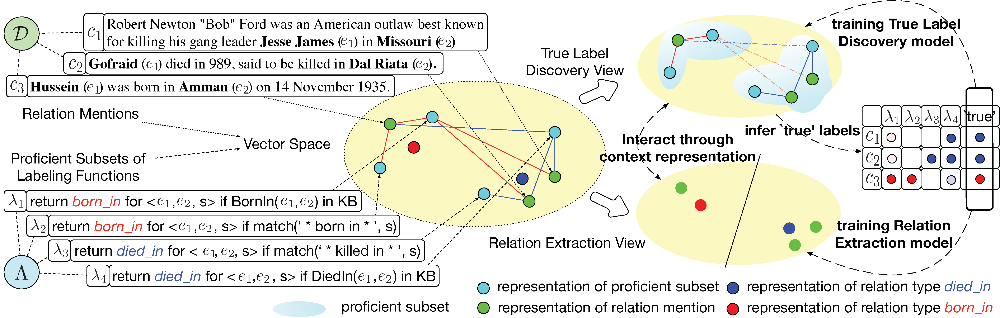

# Heterogeneous Supervision for Relation Extraction: A Representation Learning Approach

Source code and data for [Heterogeneous Supervision for Relation Extraction: A Representation Learning Approach](https://arxiv.org/abs/1707.00166)

<p align="center"></p>

--------------------------------------------------------------------------------

ReHession conducts Relation Extraction with Heterogeneous Supervision, e.g., the labeling functions at left corner.

ReHession conducts Relation Extraction, featuring:
- employ heterogeneous supervision, e.g., knowledge base and heuristic patterns, to train the model (as picked in left corner)
- infers true label from noisy labels in a context-aware manner
- true label discovery and relation extraction can mutually enhance each other

We are in an early-release beta. Expect some adventures...

- [Overview](#pipeline-overview)
- [Data](#data)
- [Labeling Functions](#labeling-functions)
- [Feature Extraction](#feature-extraction)
- [Model Learning and Evaluation](#model-learning-and-evaluation)

## Pipeline Overview

And the pipeline of ReHession is:
- recognize entities for labeling functions
- apply labeling functions to get heterogeneous supervision
- generate pos-tagging and brown clustering
- encoding training / testing corpus
- training and evaluation

## Data

## Labeling Functions


## Feature Extraction

### FE Setup
The data should be saved to `Feature_Extraction/data/source/DATA_NAME` and the dependencies listed in [dependencies](https://github.com/shanzhenren/#dependencies) should be installed and fulfilled.

### FE Command
The extractor can be called by (under the dir of Feature_Extraction)
```
bash extract.sh KBP
```
and the resulting files woule be saved to `Feature_Extraction/data/source/DATA_NAME/rm/`

## Model Learning and Evaluation

We use maven ([5 minutes to learn Maven](http://maven.apache.org/guides/getting-started/maven-in-five-minutes.html)) to manage code, and you can build the package by
```
mvn package
```
and the jar file would be compiled and stored in the target folder.

And the model learning and evaluation would be conducted at the same time by

```
java -jar target/afgre-0.1.0.jar trainfile testfile embeddingFile cvnum debugMode lr epoches batch_size noneind ifF1 lambda_0 resample neg dropout decay_ratio
```
Those parameters are:
- trainfile: path to training file
- testfile: path to test file
- embeddingFile: path to pretrained embedding
- cvnum: validation number
- debugMode
- lr: learning rate
- epoches: epoch number
- batch_size: batch size
- noneind: ind of none type (should look up the feature extraction file to find out)
- ifF1: if do f1
- lambda_0: lambda
- resample: resample number
- neg: negative sampler
- dropout: dropout ratio
- decay_ratio: decay_ratio of learning rate
and an example run command could be:
```
java -jar target/afgre-0.1.0.jar ../data/KBP/train.data ../data/KBP/test.data ../embedding/KBP/50_30_10.data 100 1 0.025 60 50 1 1 1 20 1 0.1 0.001
```